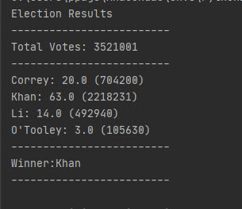

# PyPoll
Vote-counting process.

Poll in election_data.csv. 
    The dataset is composed of three columns:
     Voter ID, County, and Candidate. 
     
Created a Python script that analyzes the votes and calculates each of the following:

The total number of votes cast
* A complete list of candidates who received votes
* The percentage of votes each candidate won
* The total number of votes each candidate won
* The winner of the election based on popular vote.

Output will appear as shown below:

